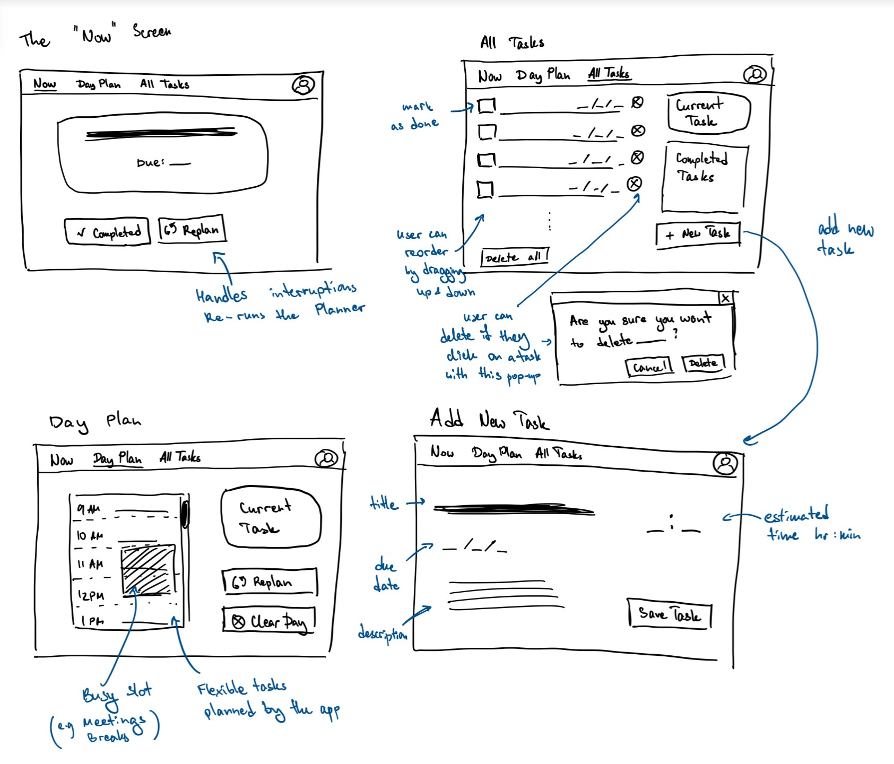

# Assignment 2

## Problem statement


**Problem domain:** Procrastination & Flexible Task Scheduling

My interest in this domain comes directly from my experience as a student. I constantly face tasks that require self-directed time management, and I often find that the act of planning my work can become a form of procrastination itself. I’m interested in exploring the challenges of not just organizing a to-do list, but of building systems that help users realistically schedule their time, maintain focus, and adapt to the fluid nature of academic and personal workloads.

**Problem:** The Disconnect Between Static Plans and Dynamic Reality

The core problem is that traditional to-do lists fail to provide a realistic and actionable path forward. They present a long, context-free list of tasks that creates cognitive overload and decision fatigue (the "paralysis of choice"). This psychological barrier is compounded by a logistical failure: the static list doesn't account for the dynamic reality of a user's schedule, available time, or fluctuating energy levels. This disconnect between the plan and reality makes the list feel irrelevant and overwhelming, leading to a cycle of procrastination, stress, and guilt.

**Stakeholders:**

-   **The Overwhelmed Student:** The direct user who struggles with decision fatigue and procrastination when faced with a long list of tasks.
-   **The Professor/Instructor:** The person who assigns tasks, sets deadlines, and evaluates the student's work.
-   **The Teammate/Collaborator:** A peer who depends on the student's timely contribution to a group project.
-   **The Therapist or Academic Coach:** A professional helping the student develop executive function skills and manage academic anxiety.


**Evidence and comparables:**

1.  [**The Decision Lab - Choice Overload**](https://thedecisionlab.com/biases/choice-overload-bias)
    > (Evidence) This article provides a foundational definition of "choice overload," explaining that an excess of options can lead to decision paralysis, procrastination, and regret. This is the core psychological principle behind the problem.

2.  [**Harvard Business Review - To-Do Lists Don't Work**](https://hbr.org/2012/01/to-do-lists-dont-work)
    > (Evidence) This HBR article points out that to-do lists fail because they lack the structure of a formal schedule. It advocates for "living in your calendar."

3.  [**Reddit - "Looking for an app that displays one task at a time?"**](https://www.reddit.com/r/productivity/comments/v37ba8/looking_for_an_app_that_displays_one_task_at_a/)
    > (Evidence) This forum thread is direct evidence of authentic user demand. A user describes their list as "overwhelming" and specifically asks for a solution that shows only the current task.
4.  [**Todoist - To-Do List App**](https://www.todoist.com/)
    > (Comparable) As a leading task management app, Todoist is a prime example of a powerful but list-centric system. Its limitation is that its core design presents users with comprehensive lists, directly contributing to the cognitive overload and paralysis of choice this project aims to solve.

5.  [**Motion - AI Calendar and Task Manager**](https://www.usemotion.com/)
    > (Comparable) Motion is a direct attempt to solve this problem using AI. Its limitations are a high cost and complexity, and its rigid, fully-automated scheduling removes user agency, which can be counterproductive when a student's dynamic reality requires flexibility.

## Application pitch


**Name:** Current

**Motivation:** Current is for anyone who feels overwhelmed and stuck by a long to-do list that doesn't fit the dynamic reality of their day.

**Key features:**
We’ve all been there: staring at a huge to-do list, feeling so overwhelmed that we don't know where to start. You end up spending hours planning your work instead of actually doing it. Then, a single unexpected meeting throws your entire "perfect" plan into chaos. Current is designed to be a calm, focused guide that cuts through that noise.

1. **The "Now" Screen**

    **What it is:** When you open the app, you won't see a list. Instead, you'll see a single screen with just one task on it: the one thing you should be working on right now. The app's simple algorithm looks at your priorities and schedule to make the choice for you.

    **Why it helps:** This feature directly eliminates the "paralysis of choice." By removing all other options, it makes it almost frictionless to begin working. For The Overwhelmed Student, this drastically reduces the cognitive load and anxiety of choosing, which helps them make progress and meet deadlines, ultimately benefiting the Professor who receives their work on time and the Therapist who can suggest the app as a study tool.

    **Note:** The algorithm behind calculating the most urgent task can be made complex but it is possible for the app to work with a simple one as well, which will be more suitable for the purposes of the class. For example, the users can prioritize the tasks themselves by (re)ordering them, or the tasks can also be prioritized based on the date they are due and estimated time of completion the user has entered in advance.

2. **Calendar-Aware Scheduling**

    **What it is:** Current connects to your main calendar to see your classes, appointments, and meetings. It then intelligently finds the real, open slots in your day and creates an achievable schedule by placing your flexible tasks within those windows.

    **Why it helps:** This grounds your plan in reality. It transforms a static wish list into a dynamic, actionable schedule. This helps The Overwhelmed Student avoid overcommitting, making them more reliable. This newfound predictability means they can make and keep promises, which is a huge relief for a Teammate/Collaborator who depends on them for a group project.

    
3. **One-Click Rescheduling**

    **What it is:** Life is unpredictable. When a meeting runs late or a task takes longer than expected, you can press a single "Re-plan my day" button. Current instantly re-evaluates your remaining tasks and proposes a new, realistic schedule for the rest of the day.

    **Why it helps:** This feature removes the guilt and stress of a "failed" plan. Instead of a day falling into chaos after one disruption, the app provides a low-stress way to adapt and keep moving forward. This builds resilience and is a key coping mechanism that a Therapist or Academic Coach would support, helping the student manage challenges without getting discouraged.


## Concept design

**Concepts:**

```
concept UserAccount
purpose to securely identify and authenticate users
principle a user must register and log in to be identified

state
  a set of Users with
    an email String
    a passwordHash String
    a displayName String

actions
  register (email: String, password: String, displayName: String)
    requires email is not already in use
    effect creates a new user
  login (email: String, password: String)
    effect authenticates the user, creating a session
  updateProfile (user: User, newDisplayName: String)
    effect changes the user's displayName
  deleteAccount (user: User)
    effect removes the user and all their associated data

```


```
concept Tasks [User]
  purpose to capture and organize a user's tasks
  principle tasks are added to a prioritized list and can be marked as complete
  state
    a set of Tasks with
      an owner User
      a description String
      an optional dueDate Date
      an optional estimatedDuration Number
      a status of TODO or DONE
      
    a UserTasks element of User with
      an orderedTasks seq of Tasks

  actions
    createUserTasks (user: User)
      requires the user doesn't already have a list of tasks created
      effect creates an empty UserTasks element for a new user
    createTask (owner: User, description: String, dueDate: optional Date, estimatedDuration: optional Number)
      effect creates a new task with status TODO and adds it to the user's list
    updateTask (task: Task, newDescription: optional String, newDueDate: optional Date, newEstimatedDuration: optional Number)
      effect modifies the details of an existing task
    reorderTasks (user: User, newOrder: seq of Tasks)
      effect updates the order of the user's tasks
    markTaskComplete (task: Task)
      effect sets the task's status to DONE
    deleteTask (task: Task)
      effect removes the task from the system
    deleteAllForUser (user: User)
      effect removes all tasks associated with the user
    getTasks (user: User): (tasks: seq of Task) 
      effect returns the user's full ordered list of tasks
    getRemainingTasks (user: User): (tasks: seq of Task)
      effect returns the user's ordered list of tasks with status TODO
```


```
concept Schedule [User]
  purpose to represent a user's non-negotiable, externally-scheduled commitments
  principle the schedule is a read-only reflection of a user's external calendar
  state
    a set of BusySlots with
      an owner User
      a startTime DateTime
      a endTime DateTime
  actions
    syncCalendar (user: User, externalEvents: set of Events)
      effect replaces the user's busy slots with a new set based on their external calendar
    deleteAllForUser (user: User)
      effect removes all busy slots for the user
    blockTime (user: User, startTime: DateTime, endTime: DateTime)
      effect creates a new BusySlot for the user to represent non-working hours or a manual block
    getSlots (user: User): (slots: set of BusySlots)
      effect returns all busy slots for the user
```
```
concept Planner [User, Task]
  purpose having a realistic, time-based plan for a user's tasks
  principle it intelligently fits a user's prioritized tasks into the open slots in their schedule
  state
    a set of ScheduledTasks with
      an owner User
      a task Task
      a plannedStart DateTime
      a plannedEnd DateTime
  actions
    planDay (user: User, tasks: seq of Task, busySlots: set of BusySlots): (firstTask: optional Task)
      effect creates a new, full-day schedule by assigning tasks to available time slots; returns the first task, if any
    replan (user: User, tasks: seq of Task, busySlots: set of BusySlots): (firstTask: optional Task)
      effect discards remaining scheduled tasks and generates a new plan from the current time forward; returns the first task, if any
    clearDay (user: User)
      effect removes all ScheduledTasks for the given user for the current day
    deleteAllForUser (user: User)
      effect removes all scheduled tasks for the user
    getNextTask (user: User, completedTask: Task): (nextTask: optional Task)
      effect finds the task scheduled immediately after the completedTask and returns it
```

```
concept Focus [User, Task]
  purpose to eliminate decision fatigue by presenting the single task a user should be working on right now
  principle it presents the currently scheduled task to the user, providing a single point of focus
  state
    a CurrentTask element of User with
      a task Task
  actions
    setCurrentTask (user: User, task: Task)
      effect sets the specified task as the user's current focus
    clearCurrentTask (user: User)
      effect removes the current task for the user
    getCurrentTask (user: User): (task: optional Task)
      effect returns the user's current task, if any
```


**Syncs:**

```
sync initializeUser
  when UserAccount.register (): (newUser)
  then Tasks.createUserTasks (user: newUser)
```

Note: This sync is essential to ensure a new user has a place to store their tasks.


```
sync planAndFocus
  when Request.viewPlan (user)
    Tasks.getTasks (user): (allTasks)
    Schedule.getSlots (user): (busySlots)
  then
    Planner.planDay (user, tasks: allTasks, busySlots): (firstTask)
    Focus.setCurrentTask (user, task: firstTask)
```

Note: This sync kicks off the core feature: the user asks to see their day, the plan is made, and the first task is put into focus.


```
sync advanceFocus
  when Tasks.markTaskComplete (completedTask)
    Focus.getCurrentTask (user): (current)
    and completedTask is current
    Planner.getNextTask (user, completedTask): (nextTask)
  then Focus.setCurrentTask (user, task: nextTask)
```

Note: This is the primary loop of the app. Finishing one task automatically brings up the next. I'm assuming helper queries like `isCurrentTask` and `getNextTask` exist to check conditions and find the right data.


```
sync replanAndFocus
  when Request.replanDay (user)
    Tasks.getRemainingTasks (user): (remainingTasks)
    Schedule.getSlots (user): (busySlots)
  then
    Planner.replan (user, tasks: remainingTasks, busySlots): (firstTask)
    Focus.setCurrentTask (user, task: firstTask)
```

Note: This sync allows the user to adapt to changes by generating a fresh plan for the rest of the day.

```
sync deleteUserData
  when UserAccount.deleteAccount (user)
  then
    Tasks.deleteAllForUser (user)
    Schedule.deleteAllForUser (user)
    Planner.deleteAllForUser (user)
    Focus.clearCurrentTask (user)
```

Note: This is an essential data integrity sync to handle account removal.

```
sync handleClearDayRequest
  when Request.clearDay (user)
  then
    Planner.clearDay (user)
    Focus.clearCurrentTask (user)
```


#### Note on Concept Roles and Composition

Each of the five concepts in the application plays a distinct and independent role, applying the idea of separation of concerns. The `UserAccount` concept serves as the foundational layer, managing identity and authentication; its purpose is to know who the user is. The `Tasks` concept acts as the master repository for everything the user needs to do, concerned only with capturing and organizing this raw data.

The `Schedule` concept provides the real-world constraints, defining when a user is unavailable due to fixed commitments from external calendars or manually blocked time. The `Planner` concept is the strategic engine. It composes information from `Tasks` (what to do) and `Schedule` (when there is time) to create a concrete, actionable daily plan. Finally, the `Focus` concept is the user-facing execution layer. Its sole job is to direct the user's attention by presenting the single `CurrentTask` they should be working on, as determined by the `Planner`.

In this composition, the generic `User` parameter in all other concepts is instantiated by the `User` from the `UserAccount` concept. The generic `Task` parameter used by the `Planner` and `Focus` concepts is instantiated by the `Task` from the `Tasks` concept.


## UI Sketches




 ## User Journey

 Alex, our user, wakes up on Sunday morning feeling overwhelmed. Her 6.1040 assignment is due tonight, she has a club meeting to prepare for, and she knows there are other chores, but her to-do list is a scattered mess across sticky notes. She opens the app on her laptop, which syncs with her Google Calendar, pulling in a "Brunch with Friends" appointment she'd forgotten about.
She navigates to the "All Tasks" view and starts by adding the tasks from her sticky notes: "Do Laundry," "Call Mom," and "Prep for club meeting." She sees the big assignment is buried in the list, so she drags it to the very top to mark it as her highest priority. Now that everything is captured, she clicks the "Re-plan my day" button located on the Main Dashboard. The app instantly generates a schedule. The persistent banner at the top of her screen updates: "CURRENT TASK: Work on 6.1040 Assignment." Finally, she has a clear starting point.
After working for an hour, she takes a break and decides to check her plan for the rest of the day. She clicks on the "Day Plan" view. She sees her brunch appointment is correctly blocked out, and her other tasks like "Do Laundry" are scheduled for the late afternoon. This gives her the confidence that everything will get done.

Later, after her assignment is submitted, she returns to the "All Tasks" view and proudly clicks the checkbox next to "Work on 6.1040 Assignment." The item grays out and moves to a "Completed" section. The persistent "Current Task" banner at the top of the screen immediately updates to her next scheduled item: "Prep for club meeting." While on this screen, she notices a task "Return library books" that is no longer relevant. She clicks the trash can icon next to it. The "Delete Confirmation" popup appears. She confirms by clicking "Delete," cleaning up her list. After a while she completes the prep for the club meeting and clicks completed in the Main Dashboard.

She finally decides to plan for tomorrow and adds a few new assignments by clicking "Add New Task" at the "All Tasks" window.

Outcome: Alex has transformed her chaotic day into an organized, actionable plan. She started with her most important task without decision fatigue, adapted her schedule on the fly, and felt a sense of accomplishment as she checked items off her list. The app successfully acted as a buffer against her usual feelings of overwhelm.